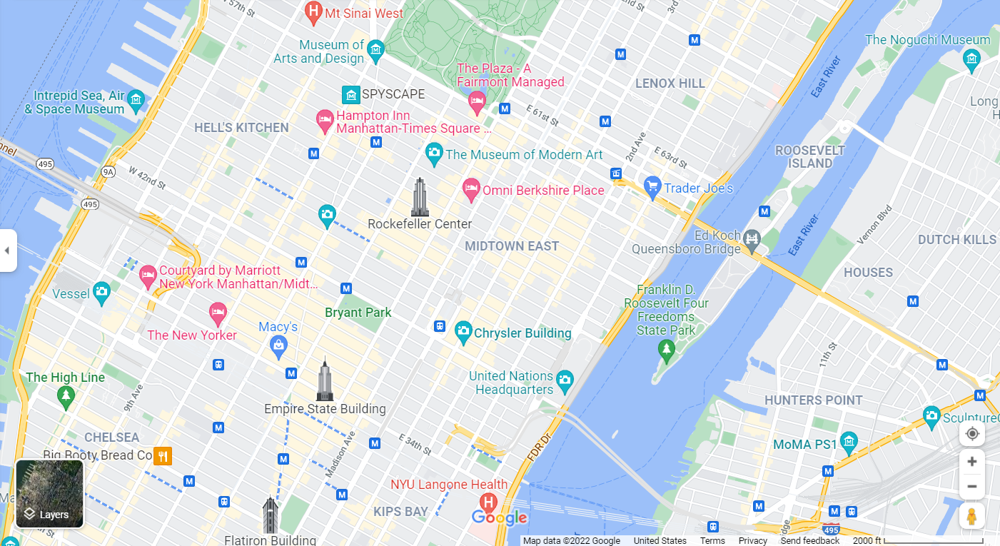
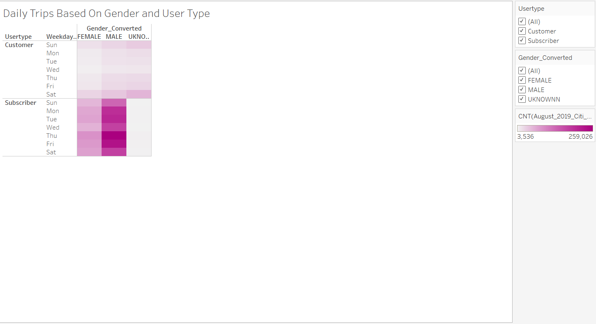

# Bike Program Analysis
## Section I: Overview Of The Analysis
The client Kate has hired SATC Consulting to assist her in developing a data analytics report about the Citi bike program in New York City. She wants to use the information within the report to pitch to investors about possibly setting up a similar program in Des Moines, Iowa. We used Tableau to present interactive data analysis about the program in New York City and then wrote up this report to provide additional information. We used the data set for August 2019 as the basis for our analyses.

## Section II: Results
There are seven visualizations within our Tableau story. All of these images are presented in this report with further explanation as to the phenomenon that they represent and what their implications are for the proposed bike program in Des Moines. 

### Subsection I.A: Trip Duration

We begin this section by discussing the average trip duration for bikes within NYC during August 2019. The results of our analysis are presented in **Figure 1-1**:

**Figure 1-1**

The chart shows that most of the bike trips did not last more than 30 minutes. Indeed, the peak of the chart shows that over 146,000 trips were five minutes long with similar numbers for the 4-minute and 6-mnute time frames. This pattern shows that customers on average did not utilize bikes for long periods of time. A possible main takeaway could be that riders utilized these bikes to go over small distances for transactional purposes and did not use them for leisure. Possible implications for a bike program in Des Moines would be that customers and subscribers would exhibit the similar behavior as New Yorkers, which would mean that the program would not generate substantial revenue per biker per ride. 

There is good reason to believe that if a bike program was created in Des Moines that the average trip duration would be higher than it would be in New York City since most bikers’ destinations are more spread out and less centralized. Take a look at the street-view maps of both cities in **Figures 1-2** (Des Moines) and **1-3** (New York City):

**Figure 1-2**

**Figure 1-3**

Notice how many more blocks and streets there are for potential bikers in New York than in Des Moines. This would suggest that many of the restaurants in Des Moines are less clustered than in NYC, creating further distances for riders. Still, pricing should be carefully assessed due to there not being as much demand for bikes in Des Moines as in NYC. A resident in NYC would be much more dependent on a bike to get around than one in Des Moines because of the inconvenience of car ownership in the city and the convenience of everything be close together. 

In the next analysis, we broke down the data by gender to see if any insights could be generated. **Figure 1-4** shows our results:

The data shows that men far outweigh women in bike rider representation in NYC. Despite he more heavy usage of bikes by men, they still exhibit similar utilization patterns as women in terms of average rip duration being 30 minutes or less. 

## Subsection I.B: Daily Trips

This next section analyzes the daily trip behavior of the NYC Citibike data set. **Figure 2-1** displays a heatmap with the peak riding hours during each day of the week:

**Figure 2-1**

The darker blue colors represent more frequent riding activity while the lighter blue colors suggest less riding activity. During the week, peak riding hours take place before and after work hours while riding activity during the weekend show more rides in the afternoons. This insight can help us better understand on ideal times to maintenance the bikes. 

The following figure shows the same type of heatmap but breaks down the biker data by gender:

**Figure 2-2**

The darker green pixels show more riding activity while the lighter green pixels show lighter riding activity. Just like with the trip duration, there are no significant differences in ride behavior among men and women. Both ride at the same peak times during the weekdays and weekends. 

The last figure we have shows the same data as the proceeding chart, but breaks the data down even further by user type (customer or subscriber):

Just like the previous charts, the darker colors rpepresent more rider activity while the lighter colors show less rider activity. The data shows that most of the male and female riders were subscribers and not cusomers which could be problematic for a bike program in Des Moinse in terms of generating recurring reveue streams and not random one-offs. 

## Subsection II.C: Additional Analyses ##

This section provides additional insights into the data that could be helpful for the proposed bike program in Des Moines. In **Figures 3-1** and **3-2**, we observed the ending locaions for the bikes and the general uilizaion patterns for all of the bikes. Our goal is to better understand the typical destinations for bike users and how much maintenance overall would be needed for the bikes.

**Figure 3-1**

**Figure 3-2**

Insights generated from the first figure show that the ending locations are generally clustered around one another, which would make sense given the short trip duration times. We believe that the destinations for bikes in a Des Moines program would be further apart given how more spread out locations are in the city. This could pose some difficulties in terms of users being able to find bikes to use. 

The second map shows bike utilization with the bigger circles showing bikes that have higher usage rates. As you can see, there are not many big circles within the plot which suggests the maintenance needs for all the bikes is not that great. 

## Section III: Summary

If a bike program is to be established in Des Moines, Iowa, we recommend that most of the bikes be set up within the city limits and not much further out given the short trip durations by the users in New York City. It can be reasonably assumed that many of the people who utilized the bike program in NYC lived close o work given how bikes were used during peak times before and afer work and were utilized for short periods of time. This may not be a pehnomnon that repeats itself for Des Moines tough which would suggests less utilization for bikes. 

Two additional visualizations that we recommend Kate use would be:

1.)	Compare the ending locations of the bike trips with locations of restartuants, offices, parks, and other businesses that could generate insights into biker behavior. Maybe this information can help us better understand where to put the bikes so that they have a higher chance of being used by residents. This is especially important for Kate’s business proposal given that businesses are less centrally locattted in Des Moines than New York City which would mean we would have to be even more careful in setting up bike rentanl lcations. 

2.)	Finally, I would create a bar chart that shows ride uilizaion by age and gender to see if there are differences among age groups. If so, I would recommend that Kate and her team locate bikes close to businesses that are targeted towards age groups who would utilize bikes more. 

--This is the end of our report, if you have any questions then please reach out to SATC Consulting.--

[link to dashboard](https://public.tableau.com/app/profile/stephen.crimi/viz/Module14Challenge_16446182308390/CitiBikeStory?publish=yes)
